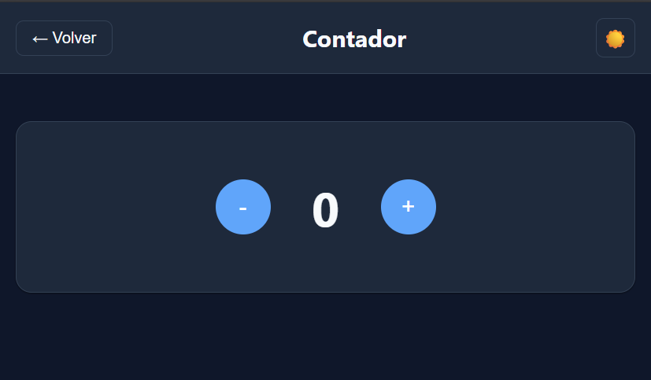

# 🎯 Día 1: Contador



## 📋 Descripción
Contador básico con botones de incremento y decremento, reset y persistencia en localStorage.

## ✨ Características
- **Incremento y decremento** con botones + y -
- **Botón de reset** para volver a cero
- **Persistencia del valor** en localStorage
- **Diseño responsive** y moderno
- **Animaciones suaves** en los botones
- **Soporte para teclado** (flechas arriba/abajo)

## 🚀 Cómo Funciona

### Lógica del Contador
```javascript
let count = parseInt(localStorage.getItem("count")) || 0;

function updateCount() {
  countDisplay.textContent = count;
  localStorage.setItem("count", count);
}

function increment() {
  count++;
  updateCount();
}

function decrement() {
  count--;
  updateCount();
}

function reset() {
  count = 0;
  updateCount();
}
```

### Persistencia de Datos
```javascript
// Cargar valor guardado al iniciar
window.addEventListener("load", () => {
  count = parseInt(localStorage.getItem("count")) || 0;
  updateCount();
});

// Guardar en cada cambio
function updateCount() {
  countDisplay.textContent = count;
  localStorage.setItem("count", count);
}
```

## 🎯 Conceptos Aprendidos

### JavaScript
- **Variables y funciones básicas**: Declaración y uso
- **DOM manipulation**: getElementById, textContent
- **Event listeners**: addEventListener para botones
- **LocalStorage**: setItem, getItem para persistencia
- **Operadores**: incremento (++), decremento (--)
- **parseInt()**: Conversión de strings a números

### CSS
- **Flexbox**: Centrado perfecto de elementos
- **Hover effects**: Transiciones en botones
- **Variables CSS**: Colores consistentes
- **Responsive design**: Adaptación móvil
- **Box-shadow**: Efectos de profundidad

### HTML
- **Estructura semántica**: Botones accesibles
- **IDs únicos**: Para selección con JavaScript
- **Accesibilidad**: Labels y aria-labels

## 🛠️ Tecnologías Utilizadas
- **HTML5**: Estructura básica y accesible
- **CSS3**: Flexbox, variables, animaciones
- **JavaScript ES6+**: Lógica del contador
- **LocalStorage**: Persistencia de datos

## 📱 Responsive Design
- **Mobile First**: Diseño optimizado para móviles
- **Flexbox**: Centrado automático
- **Touch friendly**: Botones de tamaño apropiado
- **Adaptación**: Funciona en todas las pantallas

## 🎮 Controles
- **Mouse**: Clic en botones +, -, Reset
- **Teclado**: 
  - `↑` o `+`: Incrementar
  - `↓` o `-`: Decrementar
  - `R`: Reset

## 🔧 Estructura del Código
```
dia-001/
├── index.html          # Estructura HTML
├── app.css            # Estilos específicos
├── app.js             # Lógica del contador
└── README.md          # Este archivo
```

## 🚀 Cómo Ejecutar
1. Abre `index.html` en tu navegador
2. Usa los botones + y - para cambiar el valor
3. Haz clic en Reset para volver a cero
4. El valor se guarda automáticamente
5. Recarga la página para ver la persistencia

## 💡 Mejoras Futuras
- [ ] Contador con límites (mín/máx)
- [ ] Animaciones de transición
- [ ] Sonidos de clic
- [ ] Múltiples contadores
- [ ] Historial de cambios
- [ ] Temas de colores

## 📊 Estadísticas Técnicas
- **Líneas de código**: ~50 líneas
- **Tiempo de desarrollo**: ~30 minutos
- **Complejidad**: Básica
- **Dependencias**: Ninguna
- **Persistencia**: LocalStorage

## 🎯 Casos de Uso
- **Contador de visitas**: Páginas web
- **Contador de likes**: Redes sociales
- **Contador de productos**: E-commerce
- **Contador de ejercicios**: Fitness apps
- **Contador de días**: Eventos especiales

---
*Parte del proyecto "100 Apps JS en 100 Días" - Día 1*
